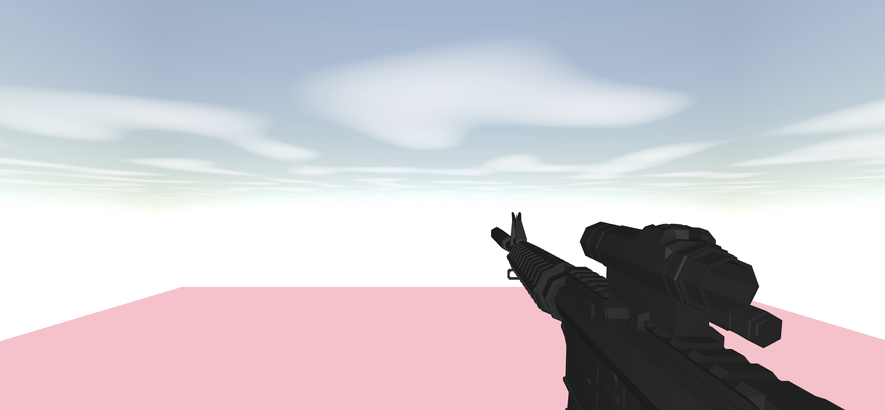
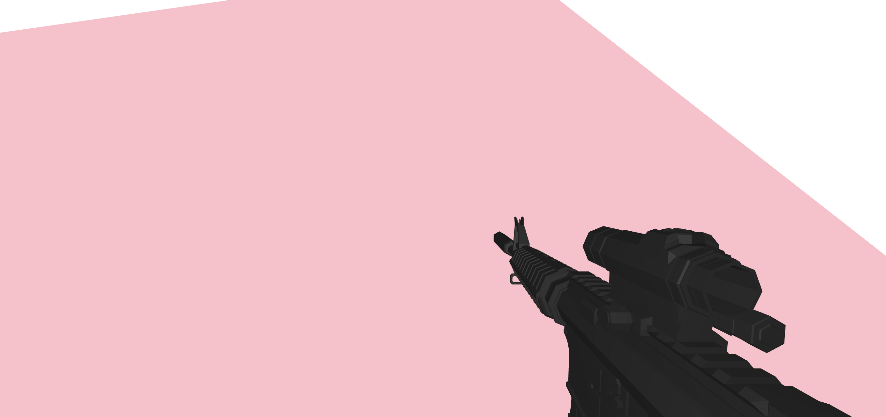
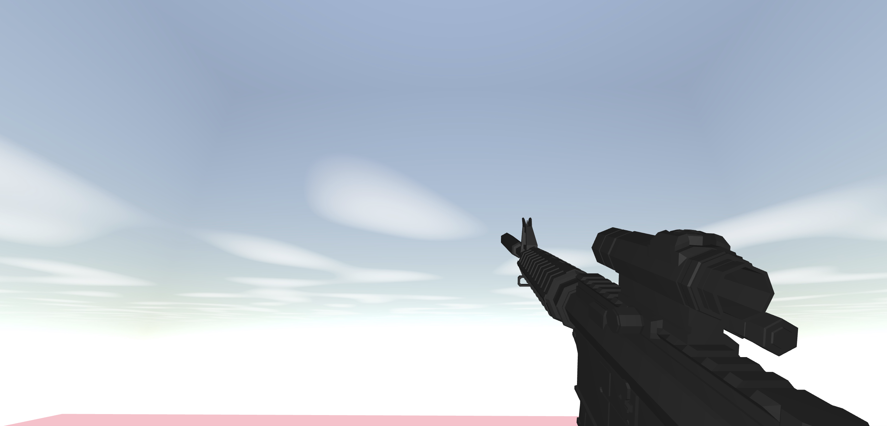

# 3D FPS Game with Three.js and TypeScript

**🚧 Work in Progress 🚧**


Dive into a 3D FPS (First Person Shooter) experience, built using Three.js and TypeScript. This game is a work in progress, promising an immersive and engaging gameplay.







## Installation

To set up and play the game locally, follow these steps:

1. Clone the repository

2. Navigate to the project directory
```bash
cd 3d-fps-game
```

3. Install the dependencies using yarn:
```bash
yarn install
```

4. Start the server
```bash
yarn run serve
```


5. Play the game by visiting:
[http://localhost:8080/](http://localhost:8080/)

## Gameplay Controls

- **Move**: Use the "W", "A", "S", "D" keys.
- **Camera Control**: Use the arrow keys.
- **Jump**: Use the "Space" key.

## Upcoming Features

- Mouse support for enhanced aiming and navigation.
- Reload and shoot animations to make the experience more realistic.

## Contributing

As this is a work in progress, contributions, ideas, and feedback are welcome. Feel free to open issues or submit pull requests.

## License

This game is licensed under the MIT License. Refer to the [LICENSE](./LICENSE) file for more details.
